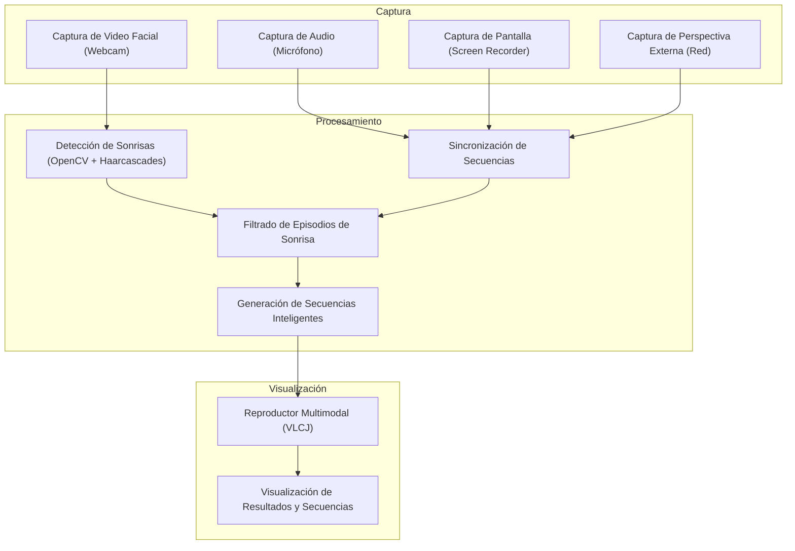
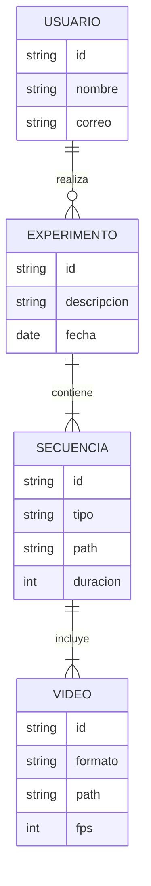

# Product Requirements Document (PRD)

## Visión General
S-Box es una plataforma de análisis multimodal de videos centrada en el estudio de la sonrisa y las respuestas emocionales humanas, orientada a investigadores, psicólogos y profesionales de la computación afectiva. El sistema permite capturar, sincronizar, analizar y visualizar videos de expresiones faciales, actividad en pantalla y perspectivas externas, utilizando inteligencia artificial y visión por computadora.

## Objetivos de Negocio
- Proveer una herramienta robusta y moderna para el análisis de sonrisas y emociones en entornos experimentales controlados.
- Facilitar la captura y sincronización de múltiples fuentes de video y audio.
- Permitir la detección automática de episodios de sonrisa y la generación de secuencias relevantes para el análisis.
- Ofrecer visualización avanzada y reproductores multimodales para el estudio detallado de los datos.
- Modernizar la solución para su despliegue en entornos productivos y facilitar su mantenimiento y escalabilidad.

## Actores Clave
- **Investigador**: Diseña experimentos, configura la captura y analiza los resultados.
- **Participante**: Interactúa con el sistema durante los experimentos.
- **Administrador**: Gestiona la infraestructura, usuarios y mantenimiento del sistema.

## Casos de Uso Principales
- **Captura Multimodal**: Registrar simultáneamente video facial, audio, actividad en pantalla y video externo.
- **Sincronización y Procesamiento**: Sincronizar automáticamente las fuentes y detectar episodios de sonrisa mediante IA.
- **Filtrado y Generación de Secuencias**: Identificar y extraer segmentos relevantes para el análisis.
- **Visualización y Reproducción**: Permitir la revisión sincronizada de las secuencias desde diferentes perspectivas.
- **Exportación y Reportes**: Generar reportes y exportar datos para análisis externo.

## Contexto de Modernización
El sistema original fue desarrollado como proyecto universitario sobre tecnologías legacy (Java 7, OpenCV 2.4.11, VLCJ antiguo, NetBeans 8.1). Se requiere migrar a tecnologías actuales (Java 17+, OpenCV moderno, contenedores, CI/CD, UI moderna) para asegurar mantenibilidad, escalabilidad y despliegue productivo.

## Diagrama de Alto Nivel

## Modelo de Dominio

## Requerimientos No Funcionales
- Compatibilidad multiplataforma (Windows, Linux, MacOS)
- Despliegue en contenedores (Docker)
- Seguridad y privacidad de datos
- Escalabilidad y mantenibilidad
- Automatización de pruebas y CI/CD
