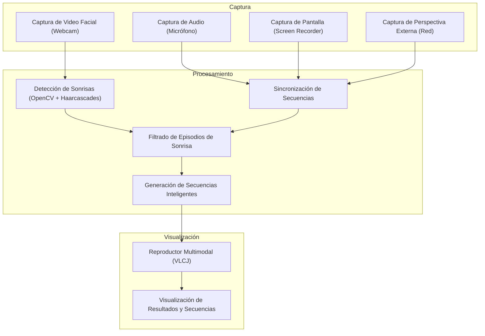
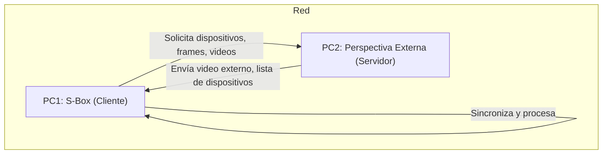
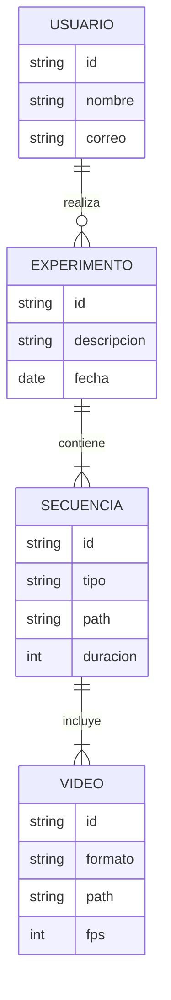
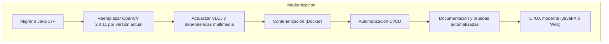

# Detalle Técnico de la Solución (Tech Solution)

## 1. Arquitectura General
S-Box es una aplicación de escritorio modular para la captura, análisis y visualización de videos multimodales, compuesta por los siguientes módulos principales:

- **Captura Multimodal**: Video facial (webcam), audio (micrófono), pantalla (screen recorder), perspectiva externa (red).
- **Procesamiento y Sincronización**: Detección de sonrisas (OpenCV), sincronización de fuentes, filtrado de episodios relevantes.
- **Visualización y Reproducción**: Reproductor multimodal (VLCJ), interfaz de usuario para análisis.
- **Gestión de Experimentos**: Organización de usuarios, experimentos y secuencias.

## 2. Componentes y Flujos

### Diagrama de Flujo de Componentes

### Diagrama de Red y Sincronización

## 3. Dependencias y Tecnologías
- **Lenguaje:** Java 7 (legacy, migrar a Java 17+)
- **IDE:** NetBeans 8.1 (legacy)
- **Visión por Computadora:** OpenCV 2.4.11 (migrar a versión actual)
- **Procesamiento de Video/Audio:** JavaCV, FFmpeg, VLCJ
- **UI:** Swing (migrar a JavaFX o Web)
- **Logging:** log4j
- **Contenedores:** No implementado (recomendado Docker)
- **Automatización:** No implementado (recomendado CI/CD)

## 4. Modelo de Dominio

## 5. Roadmap de Modernización

### Diagrama de Roadmap

### Acciones Clave
- Migrar el código fuente a Java 17+ y modularizar.
- Actualizar dependencias a versiones actuales (OpenCV, VLCJ, JavaCV, FFmpeg).
- Implementar contenedores Docker para despliegue y pruebas.
- Automatizar build, pruebas y despliegue con CI/CD (GitHub Actions, Jenkins, etc).
- Rediseñar la UI con JavaFX o migrar a una SPA web (React, Angular, etc).
- Mejorar la documentación y cobertura de pruebas.
- Asegurar cumplimiento de estándares de seguridad y privacidad.

## 6. Consideraciones de Seguridad y Privacidad
- Encriptación de datos sensibles.
- Control de acceso y autenticación.
- Cumplimiento de normativas de protección de datos.

## 7. Escalabilidad y Mantenibilidad
- Modularización del código.
- Separación de responsabilidades (captura, procesamiento, visualización).
- Uso de contenedores y automatización para facilitar despliegue y mantenimiento.
